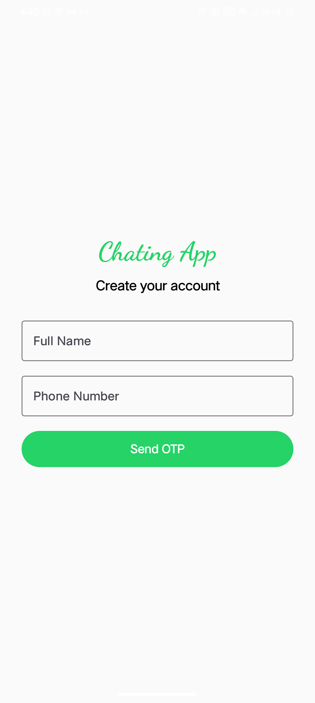
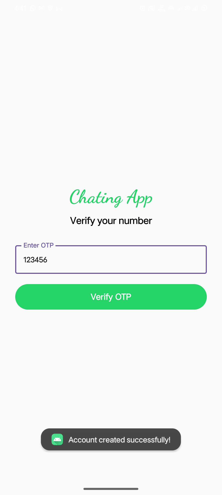
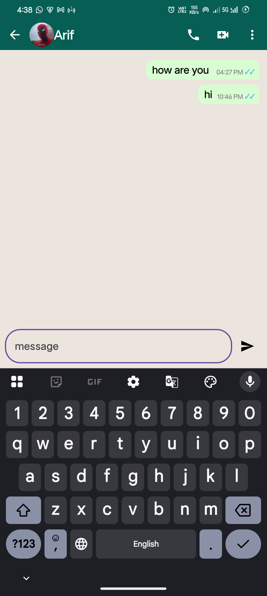
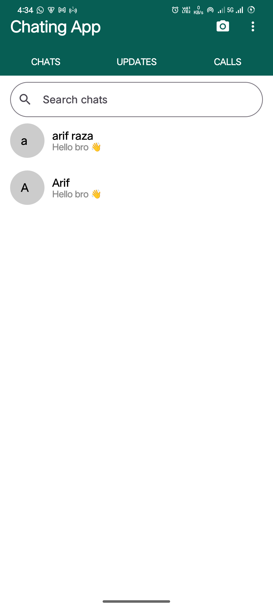
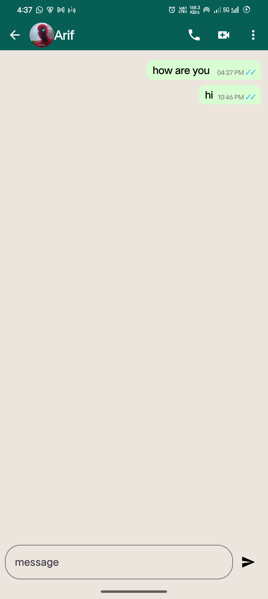

# 💬 WhatsApp Clone — Android

<p align="center">
  <strong>A modern real-time messaging application built with Kotlin & Jetpack Compose.</strong>
</p>

<p align="center">
  
  
  
  
</p>

<p align="center">
  
  
  
</p>

---

## 📱 About The Project

**WhatsApp Clone** is a modern Android messaging application developed for learning and portfolio purposes.

The project focuses on building a real-world messaging experience using **Jetpack Compose**, **Firebase**, and the **MVVM architecture**.

The application demonstrates authentication, real-time messaging, user management, online/offline presence, and reactive UI updates.

---

## ✨ Key Features

<table>
<tr>
<td width="50%">

### 🔐 Authentication

* Firebase Authentication
* Secure user login
* User registration
* Session management

</td>
<td width="50%">

### 💬 Messaging

* Real-time messaging
* Firestore synchronization
* Message timestamps
* Instant UI updates

</td>
</tr>

<tr>
<td width="50%">

### 👤 User Management

* User profiles
* User discovery
* Online/offline status
* Real-time presence

</td>
<td width="50%">

### 🎨 Modern UI

* Jetpack Compose
* Material 3
* Responsive layouts
* Smooth navigation
* Clean architecture

</td>
</tr>
</table>

---

# 🛠️ Tech Stack

| Technology                  | Usage                         |
| --------------------------- | ----------------------------- |
| **Kotlin**                  | Primary programming language  |
| **Jetpack Compose**         | Modern Android UI             |
| **Material 3**              | UI components & design system |
| **MVVM**                    | Application architecture      |
| **Firebase Authentication** | User authentication           |
| **Firebase Firestore**      | Real-time database            |
| **Coroutines**              | Asynchronous operations       |
| **StateFlow**               | Reactive state management     |
| **Navigation Compose**      | Screen navigation             |

---

# 🏗️ Architecture

The application follows the **MVVM (Model–View–ViewModel)** architecture to maintain a clean separation between UI, business logic, and data.

```text
┌──────────────────────────────┐
│          UI Layer            │
│      Jetpack Compose         │
└──────────────┬───────────────┘
               │
               ▼
┌──────────────────────────────┐
│       ViewModel Layer        │
│     StateFlow / Coroutines   │
└──────────────┬───────────────┘
               │
               ▼
┌──────────────────────────────┐
│        Repository            │
│      Data Management         │
└──────────────┬───────────────┘
               │
               ▼
┌──────────────────────────────┐
│           Firebase           │
│ Authentication + Firestore   │
└──────────────────────────────┘
```

---

# 📸 Application Screenshots

<p align="center">
  
  
  
  
  
</p>

<p align="center">
  <em>WhatsApp Clone — Application Screens</em>
</p>

---

# 🚀 Getting Started

## 1️⃣ Clone the Repository

```bash
git clone https://github.com/your-username/whatsapp-clone.git
```

```bash
cd whatsapp-clone
```

## 2️⃣ Open in Android Studio

Open the project using the latest stable version of **Android Studio**.

Allow Gradle to sync and download the required dependencies.

## 3️⃣ Configure Firebase

Create a Firebase project and connect the Android application.

Enable:

* Firebase Authentication
* Firebase Firestore

Then add your Firebase configuration file:

```text
app/
└── google-services.json
```

> ⚠️ Do not commit your personal Firebase configuration or other sensitive credentials to a public repository.

## 4️⃣ Build & Run

Connect an Android device or start an Android Emulator.

Then run the application from Android Studio.

---

# 📂 Project Structure

```text
app/
├── data/
│   ├── model/
│   ├── repository/
│   └── firebase/
│
├── ui/
│   ├── screens/
│   ├── components/
│   └── theme/
│
├── viewmodel/
│
└── MainActivity.kt
```

---

# 🔮 Future Improvements

* 📸 Image & video sharing
* 🎤 Voice messages
* 📞 Voice calling
* 📹 Video calling
* 👥 Group chat improvements
* 🔔 Push notifications
* 👀 Message read receipts
* ⌨️ Typing indicators
* 🌙 Advanced dark mode
* 🔒 Additional security features

---

# 🎯 Learning Objectives

This project was created to gain practical experience with:

* Modern Android development
* Kotlin programming
* Jetpack Compose
* MVVM architecture
* Firebase Authentication
* Firebase Firestore
* Real-time data synchronization
* State management with StateFlow
* Coroutines
* Navigation Compose
* Production-style Android project organization

---

# 🤝 Contributing

Contributions, suggestions, and improvements are welcome.

If you would like to contribute:

```bash
git fork
git clone
git checkout -b feature/your-feature
git commit -m "Add your feature"
git push
```

Then open a Pull Request.

---

# ⭐ Support

If you found this project useful or interesting, consider giving it a ⭐ on GitHub.

It helps support the project and motivates further development.

---

# ⚠️ Disclaimer

This project is created **strictly for educational and portfolio purposes**.

It is **not affiliated with, sponsored by, or endorsed by WhatsApp or Meta Platforms, Inc.**

The WhatsApp name, logo, and related trademarks belong to their respective owners.

---

<p align="center">

### 💙 Built with Kotlin & Jetpack Compose

**Made with ❤️ by Pradeep**

</p>
